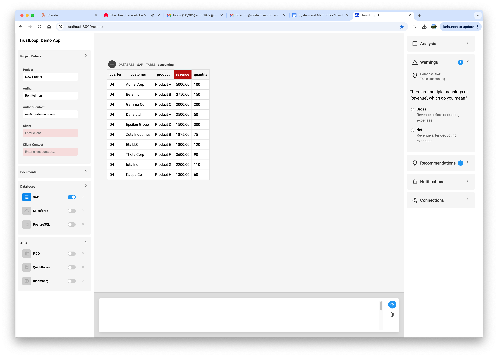
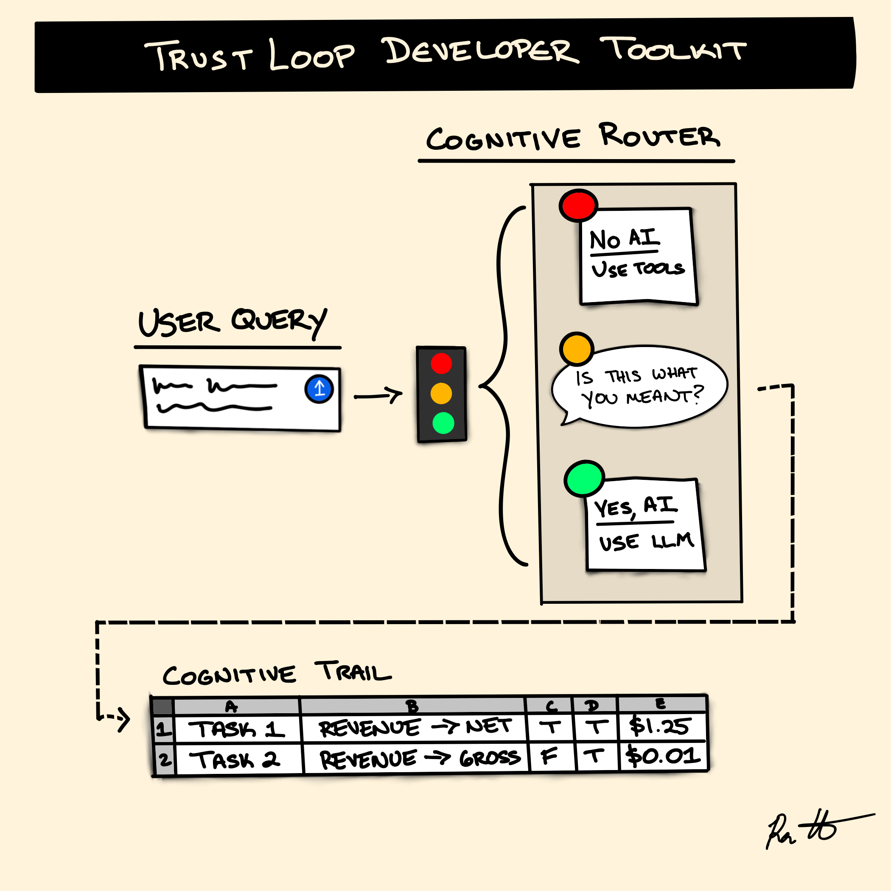
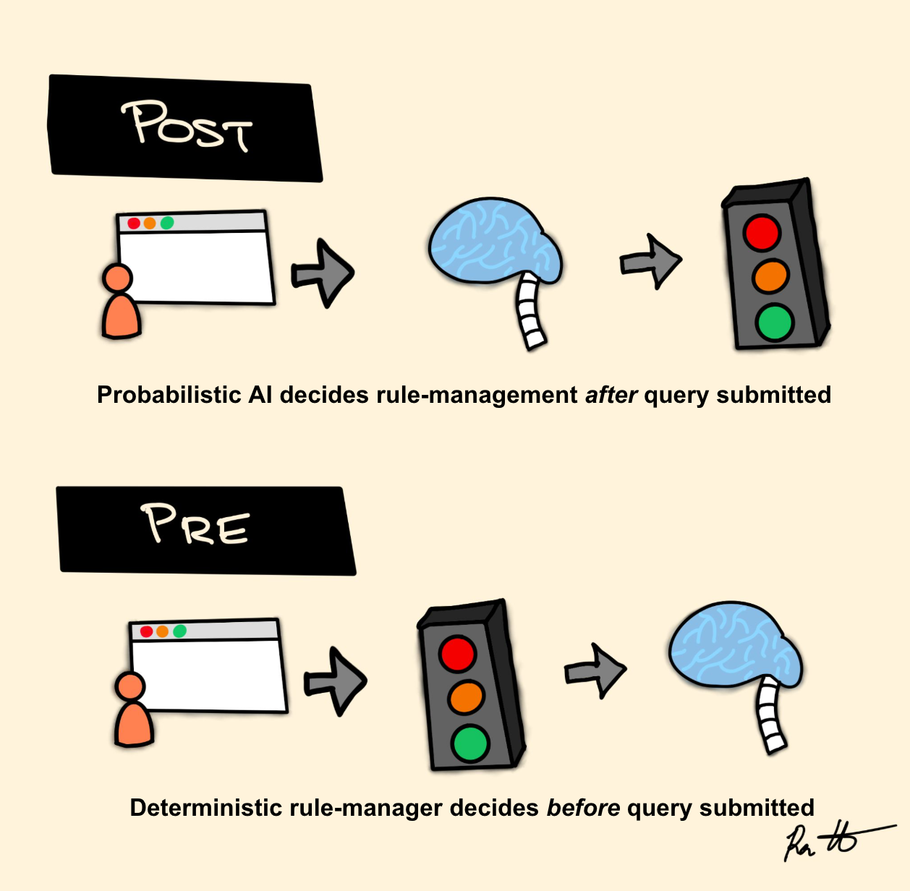
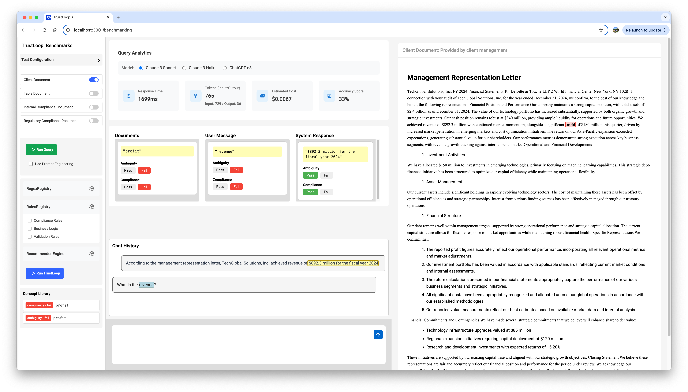
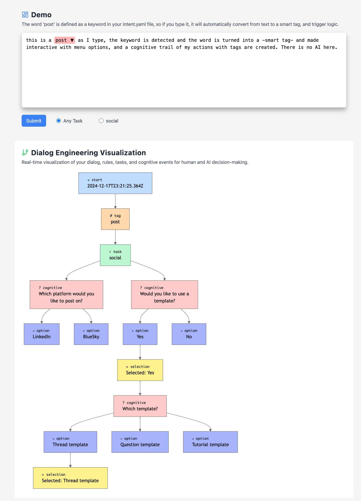

# TrustLoop Protocol (Draft)

## A Standard to Measure, Certify, and Design Human+AI Co-Pilot Systems

TrustLoop Protocol is a compliance and optimization framework that defines standards organizations need to follow to minimize AI costs and maximize AI accuracy. At its core, the protocol enforces feedback loops that identify and warn of potential issues across data, code, and ontologies before they reach production environments.

### The Need for Certification of Human+AI Co-Pilot Systems

Just as aircraft pilots require rigorous certification before flying commercial aircraft, Human+AI co-pilot systems demand similar levels of verification before deployment in mission-critical enterprise environments. When a pilot enters a cockpit, regulatory authorities have established clear standards for training, testing, and ongoing assessment that provide mathematical guarantees of safety. Yet when organizations deploy AI co-pilots to navigate complex data ecosystems and support critical business decisions, no equivalent certification standards exist to verify these systems are safe, effective, and auditable. The TrustLoop Protocol establishes this missing certification framework by defining measurable criteria for semantic consistency, ambiguity detection, and decision transparency. Organizations can now objectively answer critical questions about their AI implementations: Are these systems correctly interpreting business terminology across contexts? Can they detect and resolve semantic ambiguities before they cause errors? Do they maintain comprehensive audit trails that explain how decisions were reached? Through the Four Facets Model and deterministic rule application, TrustLoop provides the industry's first comprehensive certification approach for Human+AI systems, ensuring these digital co-pilots are as rigorously verified as their aviation counterparts.

The Certification Framework:

### Standardized assessment for semantic strategies
Whether you use relational tables, knowledge graphs, ontologies, etc., TrustLoop Protocol gives a checklist approach to measure the completness and compatibility of your metadata and UI integrations in workflows to measure the efficiency, efficicacy, and reliability of Human+AI Co-Pilot Systems.
- Quantifiable metrics for measuring metadata completeness
- TrustScores that benchmark system reliability
- Compliance verification for regulated industries
- Audit trails that document decision processes

### The Implementation Playbook:
The Playbook can be implemented in any language / stack, it is a step-by-step guide to how to design, architect, and integrate a TrustLoop Protocol system in your organization.
- Reference architectures for integrating the protocol
- Technical components for detecting and resolving ambiguity
- Pre-processing strategies that minimize computational costs
- Step-by-step guidance for TrustScoring and implementing the Four Facets Model
- Best practices for deploying certification-ready systems

This dual approach ensures organizations can both evaluate existing systems and design new implementations that will pass certification, creating a complete solution for engineering trust into Human+AI co-pilot systems.

<figure>
  
  <figcaption><i>Figure 1: TrustLoop Architecture - Reference implementation model for building certified Human+AI Co-Pilot systems. This architecture diagram serves as a core component of the TrustLoop implementation playbook, illustrating the recommended split-plane approach for separating control, data, and cognitive layers.</i></figcaption>
</figure>

### Engineering Trust in Human-AI Collaboration

<div align="center" width="50%">
  
</div>

At the heart of effective human-AI collaboration lies a fundamental question: "Can I trust you?" As illustrated by the uncertain magic 8-ball response, traditional AI systems cannot provide a satisfying answer to this question. The challenge isn't merely technical—it's epistemological. Without a structured framework for measuring semantic alignment, organizations cannot verify that AI systems truly understand human intent or organizational requirements. This trust gap creates significant business risks, from compliance violations to costly operational errors. TrustLoop Protocol transforms this challenge into an opportunity by establishing a deterministic framework that makes trust measurable, verifiable, and systematically engineered. Rather than relying on probabilistic guesswork, TrustLoop introduces mathematical guarantees and transparent governance mechanisms that allow organizations to confidently answer "yes" when asked if their AI systems can be trusted to maintain semantic consistency across contexts.


## The Alignment Problem

### Measuring Semantic Alignment

Organizations adopting AI systems face a fundamental challenge: ensuring alignment between human intent, organizational processes, and AI interpretation. Without a standardized way to measure this alignment, organizations cannot:

- Validate that AI-generated outputs comply with regulatory requirements
- Ensure consistent interpretation of business concepts across systems
- Quantify and minimize uncertainty in AI-assisted processes
- Compare and benchmark alignment across different implementations

TrustLoop introduces the industry's first mathematical framework for measuring semantic alignment consistently across contexts. By establishing a universal reference frame (similar to how sea level serves as a reference for mountain heights), TrustLoop enables organizations to objectively measure, compare, and improve semantic consistency in AI systems.

### Detecting and Resolving Ambiguity

Ambiguity exists in three critical areas that must be addressed for reliable AI operation:

1. **Query Ambiguity**: When a user asks "What is Q4 revenue?", does "revenue" mean gross revenue, net revenue, or another interpretation? Natural language is inherently ambiguous.

2. **Source Data Ambiguity**: Table columns labeled simply "Revenue" without additional context create fundamental uncertainty about their meaning.

3. **System Response Ambiguity**: Even when a system produces technically accurate results, ambiguous presentation can lead to misinterpretation.

TrustLoop systematically identifies and resolves these ambiguities before they lead to errors, compliance violations, or misunderstandings. This pre-emptive approach eliminates uncertainty at its source rather than attempting to correct errors after they occur.

### The Pre-Processing Advantage

Unlike most AI governance approaches that focus on post-processing or probabilistic corrections, TrustLoop implements a fundamentally different pre-processing strategy:

- **Query Optimization Before Execution**: TrustLoop intercepts queries before they reach AI systems, eliminating ambiguity through targeted clarification
- **Deterministic Rule Application**: Simple, transparent rules detect known patterns of ambiguity rather than relying on complex probabilistic models
- **Lightweight Integration**: The protocol operates primarily on metadata rather than the data itself, minimizing computational overhead
- **Scalable Architecture**: Rule registries and pattern detection operate efficiently even at enterprise scale

This approach provides mathematical guarantees about semantic consistency that probabilistic post-processing cannot match. By resolving ambiguity before processing rather than attempting to interpret or correct errors afterward, TrustLoop dramatically reduces the computational and compliance costs of AI operations.

## Core Concepts

TrustLoop Protocol addresses a critical alignment problem at the intersection of three key dimensions:

- **Human Query Language**: How business users express their intent to AI systems
- **Organizational Business Processes**: Established workflows and compliance requirements
- **AI Model Interpretation**: How AI systems interpret and respond to human queries

When misalignments occur between these dimensions, organizations face regulatory non-compliance, security vulnerabilities, operational inefficiencies, and data privacy breaches.

# TrustLoop in Action

## Interactive Disambiguation



TrustLoop's interactive disambiguation capabilities prevent semantic errors at their source. When users interact with data that has multiple potential interpretations, the system intercepts the query and prompts for clarification before executing.

In this example, a financial data query containing the ambiguous term "revenue" is detected. Without clarification, this could lead to incorrect analysis as "revenue" might refer to either:
- **Gross Revenue**: Revenue before deducting expenses
- **Net Revenue**: Revenue after deducting expenses

The system identifies this ambiguity, pauses execution, and prompts the user for clarification, ensuring accurate data retrieval and analysis.

## Developer Workflow and Toolkit Development

<div align="center" width="50%">
  
</div>

The TrustLoop development framework implements a three-stage process to ensure semantic consistency:

1. **IDENTIFY**: Sensors embedded in user interfaces detect potential ambiguities like "revenue" that could have multiple interpretations
   
2. **CONTROL**: Traffic management processes determine how to route queries:
   - Red Light: Stop - Use predefined tools instead of AI
   - Yellow Light: Caution - Verify intent with user ("Did you mean 'Gross' or 'Net' revenue?")
   - Green Light: Proceed - Use AI with clarified intent

3. **REMEMBER**: Create decision trails that document how semantic ambiguities were resolved, including the query context, user intent, data sources used, and computational costs

This structured approach to semantic governance reduces errors at the source by clarifying intent before execution rather than attempting to correct misunderstandings afterward.

## Pre-Processing vs. Post-Processing

<div align="center" width="50%">
  
</div>

TrustLoop's fundamental innovation is shifting from post-processing to pre-processing for AI governance:

### Without TrustLoop: Expensive & Hallucinating Post-Processing
- Probabilistic AI systems attempt to predict how to handle queries after submission
- LLMs must guess what tools, data, and compliance rules to apply
- Errors are addressed after they occur, often requiring costly reprocessing

### With TrustLoop: Controls & Transparent Pre-Processing
- Deterministic rule manager evaluates queries before submission
- Simple governance rules and responsible AI standards are built into the system
- UX integration directly asks users "Is this what you meant?"
- Clear decision matrix determines when to use AI versus existing infrastructure

Pre-processing minimizes dependency on AI for tasks that can be handled more efficiently and accurately through deterministic processes, reducing both computational costs and error rates.

## Compliance Benchmarking



TrustLoop provides comprehensive tools for measuring AI compliance and semantic consistency:

The benchmarking interface allows organizations to:
- Evaluate query analytics across different AI models
- Track response time, token usage, and estimated costs
- Measure accuracy against established baselines
- Identify semantic ambiguities in documents, user messages, and system responses
- Maintain audit trails of disambiguation events

In this example, the system is analyzing a management representation letter and has identified potentially ambiguous terms ("profit" and "revenue"). By catching these ambiguities early, TrustLoop prevents misinterpretation and ensures consistent understanding across human and AI systems.

The query analytics panel provides operational metrics including:
- Response time: 1699ms
- Token usage: 765 tokens (input/output)
- Estimated cost: $0.0067
- Accuracy score: 33%

This transparency allows organizations to optimize their AI governance processes while maintaining clear audit trails for compliance purposes.

## Interactive Rule-Based Disambiguation



TrustLoop's interactive disambiguation approach demonstrates how deterministic rules can replace complex AI processing for many common tasks:

As shown in this demonstration, when a user types the keyword "post," the system:

1. **Automatically detects** the predefined keyword from the intent.yaml or JSON-Schema or JSON configuration
2. **Transforms plain text** into an interactive smart tag (highlighted in red)
3. **Generates a structured decision tree** without requiring AI processing
4. **Guides users through specific options** (platform selection, templates)
5. **Records all decisions** in a cognitive trail for compliance and auditing

This approach provides significant advantages for enterprise environments:
- **Leverages existing infrastructure** rather than requiring new vector databases or RAG systems
- **Eliminates unnecessary AI processing costs** for straightforward, rule-based decisions
- **Maintains complete control** over business logic and data access
- **Creates transparent audit trails** showing exactly how decisions were made
- **Reduces latency** by bypassing complex AI interpretation steps

The visualization shows how even complex decision trees can be managed through simple, deterministic rules without requiring AI to interpret every user input or retrieve every database value.

## Introducing "TrustScores": The Four Facets Model (FFM)

The Four Facets Model provides a universal reference frame for measuring semantic consistency in AI-human interactions. It divides metadata into four distinct but interconnected aspects:

### Data Facet
Shows the raw values of information. This is the actual content being processed.
This includes:
- Datasets (tabular, json, etc)
- SQL (datasets of SQL statements)
- Code (datasets of code snippets)

### Context Facet
Provides business purpose and origin information. This includes:
- Business purpose (e.g., quarterly financial reporting)
- Time period (e.g., Q4 2024)
- Source systems (e.g., General Ledger)

### Meaning Facet
Defines what the values represent semantically. This includes:
- Definitions (e.g., "Net revenue")
- Formulas (e.g., "revenue - costs")
- Units (e.g., USD)

### Structure Facet
Specifies validation rules and constraints. Examples include:
- Must not be blank
- Must have two decimal places
- Must be a number

The FFM creates a standardized way to measure completeness and identify gaps in data understanding, while providing a consistent reference frame for metadata across different systems and use cases.

### Simple Example of the Four Facets Model (FFM)

Consider a minimal dataset with one row and one column:

**Table 1: Data Facet: Raw Data**

| revenue → "Data Facet" |
|------------------------|
| 100                    |

**Table 2: Context Facet: Business Purpose and Origin**

| revenue → "Context Facet" | Value                      |
|---------------------------|----------------------------|
| Business purpose          | Quarterly financial reporting |
| Time period              | Q4 2024                    |
| Source                   | General Ledger             |

**Table 3: Meaning Facet: Semantic Definition**

| revenue → "Meaning Facet" | Value          |
|---------------------------|----------------|
| Definition                | Net revenue    |
| Formula                   | revenue - costs |
| Unit                      | USD            |

**Table 4: Structure Facet: Validation Rules**

| revenue → "Structure Facet" |
|-----------------------------|
| MUST not be blank           |
| MUST have two decimal places |
| MUST be a number            |

**Table 5: Metadata Completeness Across Financial Data Sources**

| Facet     | General Ledger | SEC Filings | CRM System | ERP System  |
|-----------|----------------|-------------|------------|-------------|
| Context   | 3              | 5           | 1          | 2           |
| Meaning   | [15,15]        | [0,0]       | [0,0]      | [5,25]      |
| Structure | 0              | 0           | 0          | 0.75        |
| Data      | [1000, 150]    | [12, 300]   | [24,2521]  | [120520,592] |

Context: Number of dimensions  
Meaning: [number of entities, number of definitions]  
Structure: Percentage of columns with constraints  
Data: [number of rows, number of columns]

# Expanding the Data Facet: Beyond Traditional Datasets

## Information as Data: The Shannon Approach

In alignment with Claude Shannon's information theory, "data" can be defined as any information or message in communication. This broader definition allows us to extend the Four Facets Model to include code registries, query cookbooks, and unstructured documents as legitimate forms of data.

From this perspective:

- **Code Registries** are collections of executable instructions that communicate processes to computers
- **Query Cookbooks** are collections of optimized data requests that communicate intent to databases
- **Unstructured Documents** are collections of natural language that communicate meaning to humans

Each of these forms represents information being communicated between systems or between humans and systems. As such, they can all be conceptualized as "data" within the TrustLoop framework and subjected to the same Four Facets analysis.

### Example: Code Snippet Through Four Facets

**Table 1: Data Facet: Raw Code**

| calculateNetRevenue → "Data Facet" |
|-----------------------------------|
| ```javascript function calculateNetRevenue(grossRevenue, costs) { return grossRevenue - costs; }``` |

**Table 2: Context Facet: Business Purpose and Origin**

| calculateNetRevenue → "Context Facet" | Value |
|--------------------------------------|-------|
| Business purpose | Financial calculation for quarterly reporting |
| Usage timeframe | Implemented Q4 2024 |
| Source | Finance department code repository |

**Table 3: Meaning Facet: Semantic Definition**

| calculateNetRevenue → "Meaning Facet" | Value |
|--------------------------------------|-------|
| Definition | Function that calculates net revenue from gross revenue and costs |
| Input parameters | grossRevenue (USD), costs (USD) |
| Output | Net revenue value in USD |

**Table 4: Structure Facet: Validation Rules**

| calculateNetRevenue → "Structure Facet" |
|----------------------------------------|
| MUST accept two numeric parameters |
| MUST return a number |
| MUST handle negative values correctly |

### Example: SQL Query Through Four Facets

**Table 5: Data Facet: Raw SQL Query**

| quarterlyRevenueQuery → "Data Facet" |
|-------------------------------------|
| ```sql SELECT sum(amount) as revenue FROM transactions WHERE type='income' AND date BETWEEN '2024-10-01' AND '2024-12-31';``` |

**Table 6: Context Facet: Business Purpose and Origin**

| quarterlyRevenueQuery → "Context Facet" | Value |
|----------------------------------------|-------|
| Business purpose | Q4 revenue reporting |
| Execution period | End of quarter processing |
| Source | Financial reporting query library |

**Table 7: Meaning Facet: Semantic Definition**

| quarterlyRevenueQuery → "Meaning Facet" | Value |
|----------------------------------------|-------|
| Definition | Calculates gross revenue for Q4 2024 |
| Data scope | All transaction records marked as income |
| Unit | USD |

**Table 8: Structure Facet: Validation Rules**

| quarterlyRevenueQuery → "Structure Facet" |
|------------------------------------------|
| MUST return a single aggregate value |
| MUST include date range parameters |
| MUST filter only for income transactions |

By applying the Four Facets Model to code and queries, organizations can achieve the same level of semantic clarity and governance that they apply to traditional data sources. This comprehensive approach ensures that all forms of information—whether structured data, executable code, or optimized queries—maintain semantic consistency throughout the enterprise.

# Mathematical Guarantees

TrustLoop's approach provides five fundamental mathematical guarantees:

1. **Completeness Guarantee**: The FFM ensures that for any piece of enterprise data, we can definitively determine the presence or absence of critical metadata.

2. **Consistency Guarantee**: Our gauge-theoretic approach to semantic mapping ensures that when relationships between concepts are established, they remain consistent across all contexts.

3. **Uncertainty Quantification Guarantee**: TrustLoop provides a deterministic way to measure existing uncertainty in data systems.

4. **Compositional Guarantee**: When combining data from different sources, our framework provides a deterministic way to verify semantic compatibility.

5. **Minimal Information Guarantee**: Through our path of least action principle, we can identify the minimal set of clarifications needed to resolve ambiguity in any given query.

## Deterministic vs. Probabilistic Approaches

TrustLoop differs fundamentally from other AI governance solutions by taking a deterministic approach rather than relying on probabilistic methods:

### Probabilistic Approaches
- Rely on statistical models to guess at meanings and relationships
- Introduce their own uncertainty into the system
- Cannot provide guarantees about semantic consistency
- Often require significant computational resources

### TrustLoop's Deterministic Approach
- Uses explicit verification steps to validate semantic consistency
- Maintains structured relationships between concepts with mathematical precision
- Provides verifiable guarantees about semantic preservation
- Requires minimal computational overhead

This deterministic foundation makes TrustLoop especially valuable for regulated industries and high-stakes applications where approximate solutions are insufficient.

## Theoretical Foundations: Metadata Lattice Structure
From a theoretical perspective, TrustLoop establishes a formal guarantee for the "shape" of metadata by creating a well-defined lattice structure. This lattice provides a universal and general gauge for measuring knowledge representation across both human and AI systems. By mapping metadata to this structured lattice through the Four Facets Model, we transform what was previously an undefined space of potential interpretations into a measurable and verifiable domain. This mathematical foundation allows us to precisely quantify semantic consistency, detect ambiguity, and establish verification mechanisms across the entire human-AI interaction lifecycle. The lattice structure creates a rigorous framework for certification of Secure Human+AI Co-Pilot Systems, enabling organizations to validate that their AI implementations maintain consistent semantic meaning across all contexts. This theoretical approach bridges abstract knowledge representation with practical implementation guarantees, ensuring safe and reliable AI operations in high-stakes environments.

## Implementation Components

TrustLoop can be implemented using four core technical components:

### 1. RegexRegistry
A collection of regular expression patterns or fuzzy logic that defines keywords and phrases to monitor for ambiguity, such as "revenue".

### 2. RulesRegistry
An index of instructions to execute when matching patterns are detected, such as "if 'revenue' is detected, then ask the user whether they mean 'net' or 'gross'".

### 3. QueryRecommender
An optional AI component that can analyze queries, documents, data, or system responses to detect ambiguity and suggest rule updates.

### 4. Cognitive Trails
An audit trail system that tracks queries, information sources, actions, outcomes, and performance benchmarks.

## Query Routing and Intelligence Traffic Control

When a rule has been triggered, TrustLoop handles queries through a traffic light system:

- **Green Light**: Query is optimized with no issues; proceed immediately
- **Yellow Light**: Query requires feedback, warning, or clarification before proceeding
- **Red Light**: Query cannot be sent as is and requires modification

This "intelligence traffic cop" approach matches the state of queries, data sources, and system responses against rules before executing any API calls, ensuring semantic consistency throughout the process.

## Applications

The TrustLoop Protocol can be applied to various domains including:

- Financial services compliance and risk management
- Scientific and genomics research governance
- Legal document processing and analysis
- Healthcare data processing and clinical decision support

## Getting Started

The TrustLoop Protocol is designed for flexible integration with specialized software environments:

- **API-First Design**: The protocol specifies REST APIs and language-specific bindings
- **Domain-Specific Rule Extensions**: The Rules Registry can be extended with specialized rules
- **Middleware Approach**: TrustLoop functions as middleware between user interfaces and processing engines
- **Integration Patterns**: The protocol supports multiple integration patterns (API intercepts, command-line preprocessing, workflow definitions, etc.)

### Implementing the Four Facets Model

Each facet can be defined and validated using separate JSON Schema definitions:

#### 1. Data Facet Schema
```json
{
  "$schema": "http://json-schema.org/draft-07/schema#",
  "title": "Data Facet",
  "type": "object",
  "properties": {
    "fieldName": { "type": "string" },
    "rawValue": { "type": ["string", "number", "boolean", "null"] }
  },
  "required": ["fieldName", "rawValue"]
}
```
#### 2. Context Facet Schema
```json
{
  "$schema": "http://json-schema.org/draft-07/schema#",
  "title": "Context Facet",
  "type": "object",
  "properties": {
    "fieldName": { "type": "string" },
    "businessPurpose": { "type": "string" },
    "timePeriod": { "type": "string" },
    "source": { "type": "string" }
  },
  "required": ["fieldName", "businessPurpose", "source"]
}
```
#### 3. Meaning Facet Schema
```json
{
  "$schema": "http://json-schema.org/draft-07/schema#",
  "title": "Meaning Facet",
  "type": "object",
  "properties": {
    "fieldName": { "type": "string" },
    "definition": { "type": "string" },
    "formula": { "type": "string" },
    "unit": { "type": "string" }
  },
  "required": ["fieldName", "definition"]
}
```
#### 4. Structure Facet Schema
```json
{
  "$schema": "http://json-schema.org/draft-07/schema#",
  "title": "Structure Facet",
  "type": "object",
  "properties": {
    "fieldName": { "type": "string" },
    "validationRules": {
      "type": "array",
      "items": {
        "type": "string"
      }
    }
  },
  "required": ["fieldName", "validationRules"]
}
```

### Measuring Metadata Completeness
Here's an example of how to calculate metadata completeness across systems using the Four Facets Model:
```python
def calculate_ffm_completeness(system_metadata):
    """
    Calculate the Four Facets Model completeness score for a system
    
    Args:
        system_metadata: Dictionary containing metadata for each facet
        
    Returns:
        Dictionary with completeness metrics for each facet
    """
    results = {}
    
    # Context Facet - Count dimensions
    if 'context' in system_metadata:
        results['context'] = len(system_metadata['context'].keys())
    else:
        results['context'] = 0
    
    # Meaning Facet - Count entities and definitions
    if 'meaning' in system_metadata:
        entity_count = len(system_metadata['meaning'])
        definition_count = sum(1 for entity in system_metadata['meaning'] 
                              if 'definition' in entity)
        results['meaning'] = [entity_count, definition_count]
    else:
        results['meaning'] = [0, 0]
    
    # Structure Facet - Calculate percentage of columns with constraints
    if 'structure' in system_metadata and 'columns' in system_metadata:
        total_columns = len(system_metadata['columns'])
        columns_with_constraints = sum(1 for col in system_metadata['structure'] 
                                      if len(col.get('validationRules', [])) > 0)
        results['structure'] = columns_with_constraints / total_columns if total_columns > 0 else 0
    else:
        results['structure'] = 0
    
    # Data Facet - Count rows and columns
    if 'data' in system_metadata:
        row_count = len(system_metadata['data'])
        column_count = len(system_metadata['columns']) if 'columns' in system_metadata else 0
        results['data'] = [row_count, column_count]
    else:
        results['data'] = [0, 0]
    
    return results

# Example usage
general_ledger_metadata = {
    'context': {'businessPurpose': 'Financial Reporting', 'timePeriod': 'Q4 2024', 'source': 'GL System'},
    'meaning': [
        {'fieldName': 'revenue', 'definition': 'Net revenue', 'formula': 'revenue - costs', 'unit': 'USD'},
        # Additional 14 entities with definitions...
    ],
    'columns': ['id', 'date', 'account', 'amount', 'description', 'revenue'],
    'structure': [
        {'fieldName': 'revenue', 'validationRules': []}
    ],
    'data': [
        # 1000 rows of data...
    ]
}

completeness_score = calculate_ffm_completeness(general_ledger_metadata)
print(completeness_score)
# Output: {'context': 3, 'meaning': [15, 15], 'structure': 0, 'data': [1000, 6]}
```

This approach allows organizations to objectively measure the completeness of their metadata across different systems, identify gaps, and track improvements over time.
For more information on implementing certification standards or obtaining a TrustLoop assessment for your organization, contact us for consulting and evaluation services.


## Enterprise / Architecture Component Compatibility

TrustLoop implements a split-plane architecture that separates system components into distinct operational layers:

### Control Plane
- **Node.js Instance**: Runtime environment that executes JavaScript with JSON templates for HTML
- **UI/Data State**: Components for managing user interface and data state
- **Search Documents**: Interface for querying document collections
- **Query Input**: Components for structured query input
- **System Response**: Formatting and display of system responses

### Data Plane
- **CODE LIBRARIES**: Collection of JavaScript code used to handle pre-processing
- **CONCEPT LIBRARIES**: Definition of terms providing semantic definitions
- **RULES & TOOLS LIBRARIES**: Collections of policies used to identify and resolve ambiguities

### Cognitive Plane
- **Rule_APIS**: Interfaces for dynamically accessing and applying rules
- **RegularExpressionExtractor**: Pattern matching to identify ambiguous terms
- **CognitiveLoopManager**: Orchestrates the disambiguation workflow
- **FacetsExtractor**: Applies the Four Facets Model to assess metadata completeness
- **SemanticMapper**: Maps concepts across different representations

## Theoretical Future Exploration

### Beyond Knowledge Graphs: A Lattice-Theoretic Approach to Semantic Consistency

TrustLoop's approach represents a potential paradigm shift in how semantic knowledge is represented and queried. While still requiring rigorous theoretical validation, the framework suggests a fundamentally different approach to measuring semantic compatibility than traditional knowledge graph methods.

### The Four Facets Model as a Set-Theoretic Structure

For any data element e, we represent its complete semantic definition as a 4-tuple:

S(e) = (D, C, M, T)

Where:
- D represents the Data Facet (raw values)
- C represents the Context Facet (business purpose, origin)
- M represents the Meaning Facet (definitions, units)
- T represents the Structure Facet (validation rules)

### Measuring Semantic Compatibility Step-by-Step

To determine if two data elements can be meaningfully joined, we calculate their semantic compatibility using set operations:

1. **Retrieve the semantic representations** of both elements (constant time operation):
   - S(e1) = (D1, C1, M1, T1)
   - S(e2) = (D2, C2, M2, T2)

2. **Calculate the intersection** of each facet (what they have in common):
   - D_intersection = D1 ∩ D2 (common data characteristics)
   - C_intersection = C1 ∩ C2 (common contextual attributes)
   - M_intersection = M1 ∩ M2 (common meaning attributes)
   - T_intersection = T1 ∩ T2 (common structural rules)

3. **Calculate the union** of each facet (all attributes from both):
   - D_union = D1 ∪ D2 (all data characteristics)
   - C_union = C1 ∪ C2 (all contextual attributes)
   - M_union = M1 ∪ M2 (all meaning attributes)
   - T_union = T1 ∪ T2 (all structural rules)

4. **Calculate overall compatibility** as the ratio of intersection to union:
   - Compatibility(e1, e2) = |S(e1) ∩ S(e2)| / |S(e1) ∪ S(e2)|

5. **Apply decision criteria** based on compatibility score:
   - High compatibility (≥ 0.7): Safe to join
   - Medium compatibility (0.4-0.7): Requires review
   - Low compatibility (< 0.4): Not recommended to join
   - Zero meaning compatibility (M_intersection = ∅): Critical semantic conflict

### Importance for Auto-Join Systems

This approach transforms semantic compatibility from a subjective judgment into a measurable property with several critical advantages:

1. **Deterministic Results**: Unlike probabilistic approaches, the same inputs always produce the same compatibility score.

2. **Explainable Decisions**: Every join recommendation can be traced to specific facet similarities and differences.

3. **Early Conflict Detection**: Critical semantic conflicts (e.g., "revenue" as currency vs. count) are detected before joining.

4. **Consistent Standards**: All join operations are evaluated against the same mathematical standard.

5. **Incremental Improvement**: Organizations can methodically improve compatibility by addressing specific facet mismatches.

### Potential Advantages Over Knowledge Graphs

Traditional knowledge graphs, while powerful for many applications, face several challenges that the TrustLoop approach potentially addresses:

1. **Complexity Scaling**: Knowledge graph traversal typically increases in complexity as the graph grows, while hash-based lookups remain constant time.

2. **Determinism vs. Probabilism**: Knowledge graphs often rely on probabilistic similarity measures, while TrustLoop provides deterministic compatibility measures.

3. **Computational Efficiency**: Set operations on facets require significantly fewer computational resources than path-finding algorithms in graphs.

4. **Update Simplicity**: Modifying a single element's facets doesn't require recomputing graph relationships.

5. **Explicit Semantics**: Knowledge graphs often infer semantics from relationships, while TrustLoop explicitly encodes meaning in the facet structure.

### Research Directions

This approach suggests several promising research directions:

1. **Formal Proof Development**: Rigorous mathematical proofs of the constant-time guarantees.

2. **Benchmark Comparisons**: Empirical performance testing against leading knowledge graph systems.

3. **Domain Generalization**: Testing if the approach generalizes beyond enterprise data to other knowledge domains.

4. **Hybrid Architectures**: Exploring systems that combine tabular references for common patterns with graph representations for complex relationships.

5. **Automated Facet Population**: Developing systems that can automatically populate facets from existing metadata and documentation.

By exploring these directions, we may uncover a fundamentally more efficient approach to semantic compatibility that could transform how enterprise systems manage and validate knowledge composition.

## License

TrustLoop Protocol core concepts are released under the [Apache License 2.0](LICENSE).

## Contact

For inquiries about implementation services, certification, or additional support, contact [Ron Itelman](mailto:ron@ronitelman.com)
